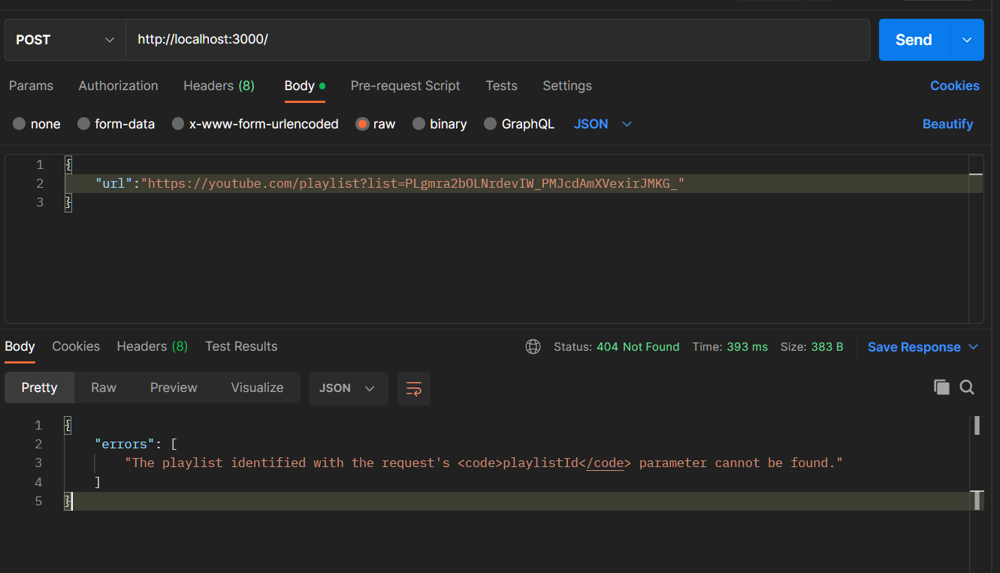
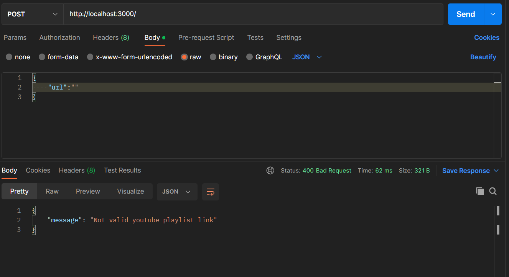
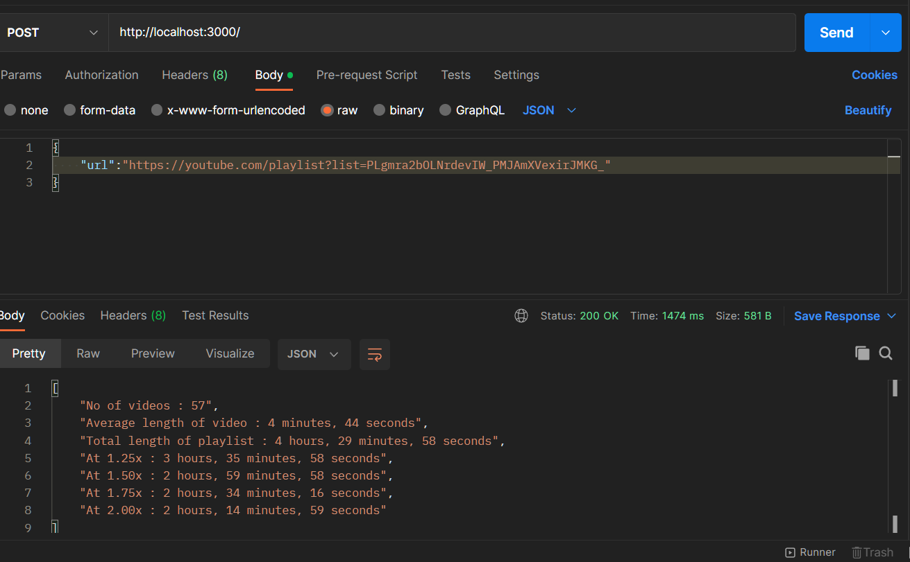

# ytplaylist-len

This project is backend implementation with node js to get youtube playlist length
This project is inspired by this website https://ytplaylist-len.sharats.dev

### Clone the repository

1. Open your terminal or command prompt.
2. Navigate to the directory where you want to clone the repository.
3. Run the following command:

```
git clone https://github.com/ahmed-m-abdelfatah/ytplaylist-len.git
```

### Install the dependencies

1. Navigate to the project directory using the terminal or command prompt.
2. Run the following command to install the project dependencies:

```
npm install
```

### Set up the API keys

1. Edit the following lines in the `.env` file:

```
PORT = YOUR_DATA
GOOGLE_API_KEY = YOUR_DATA
```

2. Replace `GOOGLE_API_KEY` with your own YouTube API key. You can get a key by following the instructions in the [YouTube Data API documentation](https://developers.google.com/youtube/registering_an_application).

### Start the application

1. Run the following command in the terminal or command prompt to start the application:

```
npm start
```

2. Open your web browser and navigate to `http://localhost:3000`.

That's it! You should now be able to use the "ytplaylist-len" application.

### Error



### Error



### Success


